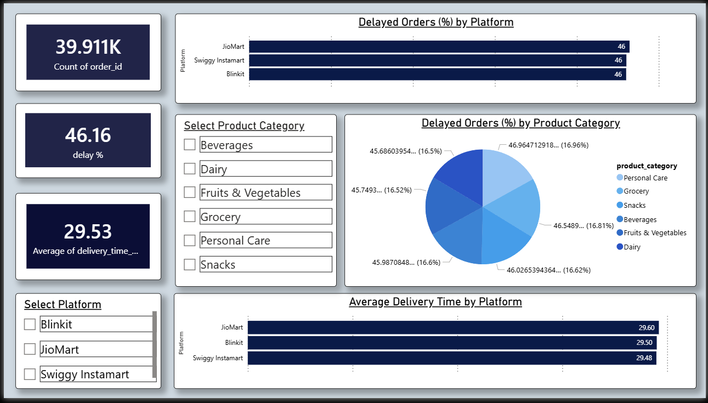

# Delivery Performance Analytics Dashboard

## Overview

This project focuses on analyzing delivery operations data to assess delivery performance, identify delay patterns, evaluate customer experience, and compare platform efficiency.

The analysis was carried out using Python, MySQL, Power BI, and DAX.

## Tools Used

* Python
* Pandas
* MySQL
* Power BI
* DAX

## Key KPIs

* Total Orders
* Average Delivery Time
* Delay Percentage

## Dashboard Features

* Platform-wise Performance Analysis
* Category-wise Delay Analysis
* Interactive Filters and Slicers
* KPI Cards for Key Metrics

## Dashboard Preview

## Key Insights

* Approximately 46% of orders were delivered with delays.
* Delivery performance differs across platforms.
* Certain product categories experience higher delay rates than others.
* Orders with delivery delays tend to have a slightly higher refund rate.

## Project Structure

* Data
* Data_Preparation
* SQL_Analysis
* PowerBI_Dashboard
* Dashboard_Screenshots

## Author

**Shrawani Sanjay Bonde**

Aspiring Data Analyst | SQL | Python | Power BI
